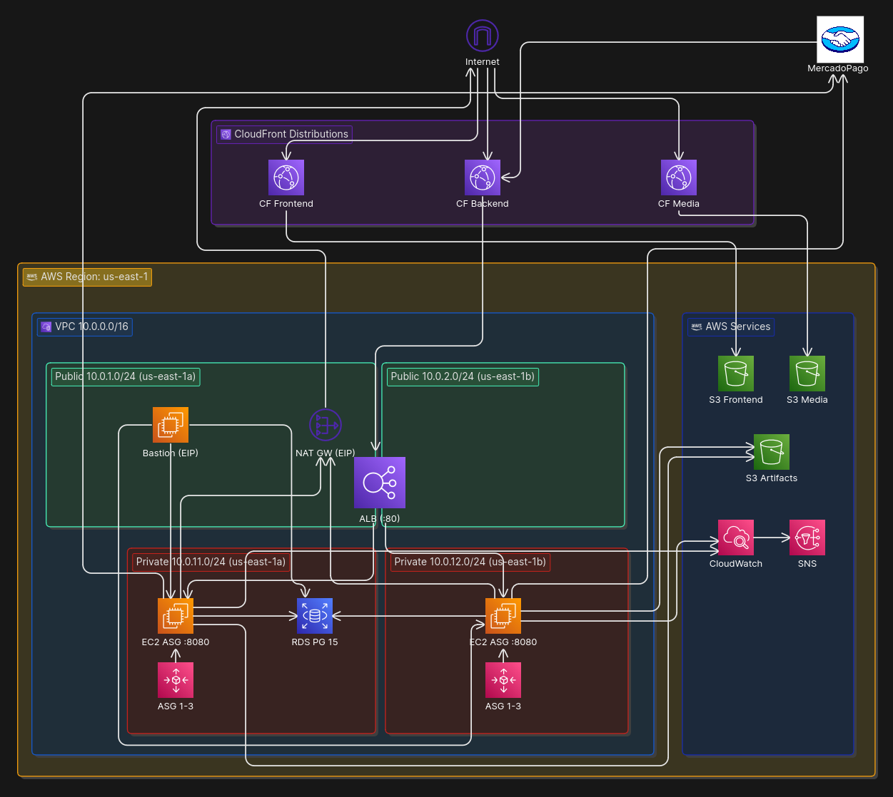
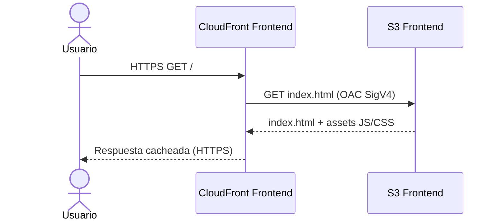
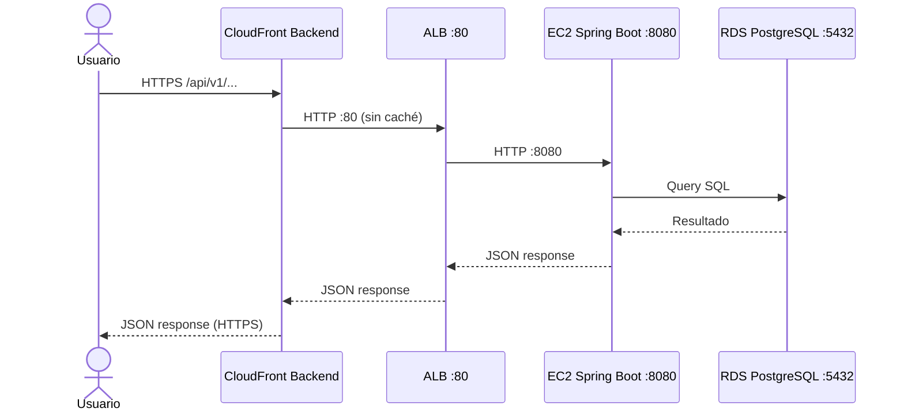
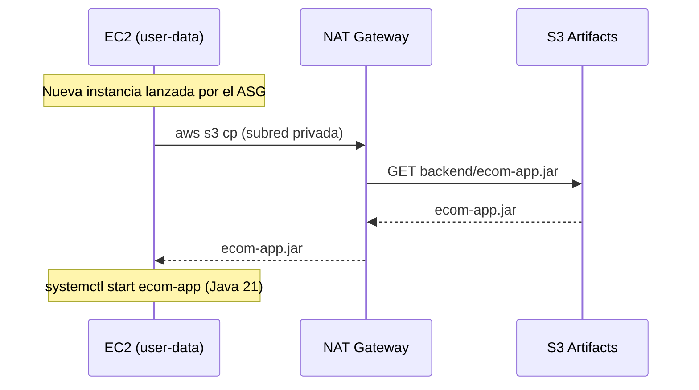
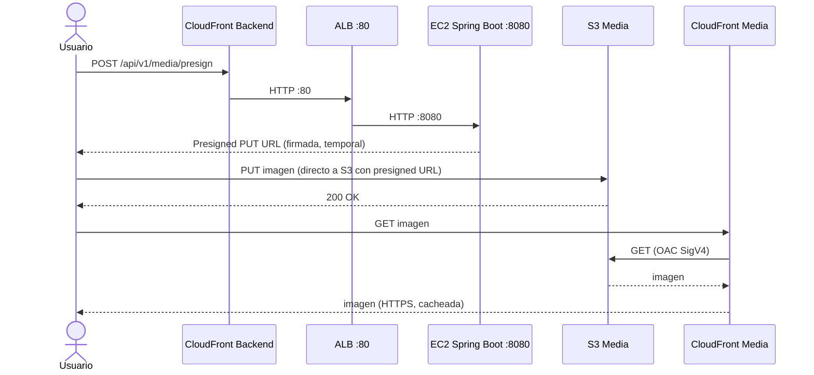
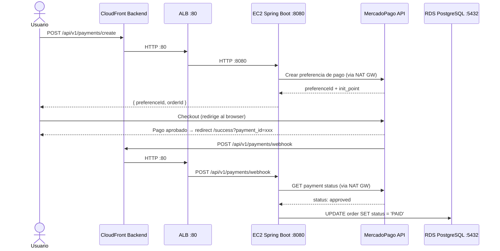

# Arquitectura AWS — Plataforma de E-Commerce

Plataforma de e-commerce desplegada en AWS mediante Infrastructure as Code (CloudFormation).
Stack: React 18 + Vite (frontend), Spring Boot 3 / Java 21 (backend), PostgreSQL 15 (RDS).

---

## Diagrama de arquitectura



---

## 1. VPC y Red

### VPC principal

| Atributo | Valor |
|---|---|
| Nombre | `ecom-vpc-prod` |
| CIDR | `10.0.0.0/16` |
| DNS support / hostnames | habilitados |
| Región | `us-east-1` |

### Subredes públicas

| Nombre | CIDR | AZ | Recursos |
|---|---|---|---|
| `ecom-subnet-public-1a-prod` | `10.0.1.0/24` | `us-east-1a` | Bastion Host, NAT Gateway, nodo ALB |
| `ecom-subnet-public-1b-prod` | `10.0.2.0/24` | `us-east-1b` | nodo ALB |

Las dos subredes públicas son requeridas por el ALB: AWS exige al menos 2 AZ para crear un Application Load Balancer.

### Subredes privadas

| Nombre | CIDR | AZ | Recursos |
|---|---|---|---|
| `ecom-subnet-private-1a-prod` | `10.0.11.0/24` | `us-east-1a` | EC2 (ASG), RDS |
| `ecom-subnet-private-1b-prod` | `10.0.12.0/24` | `us-east-1b` | EC2 (ASG) |

EC2 y RDS comparten el mismo tier privado (sin subredes de DB separadas).

### Internet Gateway y NAT Gateway

| Componente | Detalle |
|---|---|
| Internet Gateway | `ecom-igw-prod`, adjunto a la VPC |
| NAT Gateway | `ecom-natgw-prod`, en `10.0.1.0/24` (us-east-1a), EIP fija |

Ambas subredes privadas enrutan `0.0.0.0/0` al NAT Gateway. Cada subred tiene su propia route table.

### Route Tables

| Route Table | Ruta | Target | Subredes asociadas |
|---|---|---|---|
| `ecom-rtb-public-prod` | `0.0.0.0/0` | Internet Gateway | public-1a, public-1b |
| `ecom-rtb-private-1a-prod` | `0.0.0.0/0` | NAT Gateway | private-1a |
| `ecom-rtb-private-1b-prod` | `0.0.0.0/0` | NAT Gateway | private-1b |

---

## 2. Security Groups

Modelo de mínimo privilegio: cada capa solo acepta tráfico del origen estrictamente necesario.

| Security Group | Inbound | Desde |
|---|---|---|
| `ecom-sg-alb-prod` | TCP 80, TCP 443 | `0.0.0.0/0` |
| `ecom-sg-bastion-prod` | TCP 22 | `0.0.0.0/0` |
| `ecom-sg-ec2-prod` | TCP 8080 | `ecom-sg-alb-prod` |
| `ecom-sg-ec2-prod` | TCP 22 | `ecom-sg-bastion-prod` |
| `ecom-sg-rds-prod` | TCP 5432 | `ecom-sg-ec2-prod` |
| `ecom-sg-rds-prod` | TCP 5432 | `ecom-sg-bastion-prod` |

Todos los Security Groups tienen outbound abierto (`0.0.0.0/0`).
Las instancias EC2 tienen **IMDSv2 obligatorio** (`HttpTokens: required`) para prevenir ataques SSRF al servicio de metadata.

---

## 3. Compute

### Bastion Host

| Atributo | Valor |
|---|---|
| Nombre | `ecom-bastion-prod` |
| Tipo | `t2.micro` |
| AMI | Amazon Linux 2023 (SSM dynamic) |
| Subred | `ecom-subnet-public-1a-prod` |
| IP elástica | `ecom-eip-bastion-prod` |
| Paquetes | `postgresql15` |
| Propósito | SSH admin a EC2 privadas + psql admin a RDS |

### Launch Template (`ecom-lt-prod`)

| Atributo | Valor |
|---|---|
| Tipo de instancia | `t2.medium` (2 vCPU, 4 GB RAM) |
| AMI | Amazon Linux 2023 (SSM dynamic, siempre la más reciente) |
| Puerto app | `8080` (Spring Boot) |
| EBS | 20 GB gp2 |
| Runtime | Java 21 Amazon Corretto |
| Proceso | `systemd` service `ecom-app`, usuario `ecom` sin shell |
| Origen del JAR | `s3://ecom-artifacts-prod-{accountId}/backend/ecom-app.jar` |

### Auto Scaling Group (`ecom-asg-prod`)

| Atributo | Valor |
|---|---|
| Min / Desired / Max | 1 / 1 / 3 |
| Subredes | `private-1a`, `private-1b` |
| Health check | ELB (grace period 300 s) |
| Scaling policy | Target Tracking — `ASGAverageCPUUtilization` al **50%** |

---

## 4. Load Balancing

### Application Load Balancer (`ecom-alb-prod`)

| Atributo | Valor |
|---|---|
| Tipo | `application`, internet-facing, IPv4 |
| Subredes | `public-1a`, `public-1b` (multi-AZ) |
| Idle timeout | 60 s, HTTP/2 habilitado |

### Target Group (`ecom-tg-prod`)

| Atributo | Valor |
|---|---|
| Protocolo / Puerto | HTTP / 8080 |
| Target type | `instance` |
| Health check | `GET /api/v1/health` cada 30 s, timeout 5 s |
| Healthy / Unhealthy threshold | 2 / 3 checks |
| Deregistration delay | 30 s |

### Listener

| Puerto | Protocolo | Acción |
|---|---|---|
| 80 | HTTP | forward → `ecom-tg-prod` |

---

## 5. Base de Datos

### RDS PostgreSQL (`ecom-rds-prod`)

| Atributo | Valor |
|---|---|
| Engine | PostgreSQL 15 |
| Instancia | `db.t3.micro` |
| DB / Usuario / Puerto | `ecomdb` / `ecomadmin` / `5432` |
| Multi-AZ | `false` (Single-AZ, limitación del sandbox) |
| Storage | 20 GB gp2, auto-scaling hasta 100 GB |
| Backup | 7 días, ventana `03:00–04:00 UTC` |
| DeletionPolicy | `Snapshot` |
| Schema | Hibernate `ddl-auto=update` |

---

## 6. S3 — Buckets

| Bucket | Propósito | Acceso lectura | Acceso escritura |
|---|---|---|---|
| `ecom-artifacts-prod-{accountId}` | JAR del backend (`backend/ecom-app.jar`) | EC2 via IAM role (bootstrap) | Deploy manual |
| `ecom-frontend-prod-{accountId}` | Build Vite/React (HTML, JS, CSS) | CloudFront via OAC SigV4 | Deploy manual |
| `ecom-media-prod-{accountId}` | Imágenes de productos | CloudFront via OAC SigV4 | Browser via presigned PUT URL |
| `ecom-cloudtrail-logs-prod-{accountId}` | Logs de auditoría CloudTrail | — | Servicio CloudTrail |

Todos los buckets tienen acceso público bloqueado. El bucket de media tiene CORS habilitado (`GET`, `PUT`) para permitir uploads directos desde el browser.

---

## 7. CloudFront — Distribuciones

| Distribución | Origin | Cache | Protocolo viewer |
|---|---|---|---|
| `ecom-cf-frontend-prod` | S3 frontend (OAC SigV4) | CachingOptimized | redirect-to-https |
| `ecom-cf-backend-prod` | ALB en HTTP:80 | CachingDisabled | redirect-to-https |
| `ecom-cf-media-prod` | S3 media (OAC SigV4) | CachingOptimized | redirect-to-https |

La distribución de frontend tiene Custom Error Responses: HTTP 403/404 → 200 `index.html` para habilitar el routing de React Router (SPA).

La distribución de backend usa `AllViewerExceptHostHeader` como origin request policy, reenviando headers, cookies y query strings al ALB.

---

## 8. Monitoreo y Auditoría

### CloudWatch — Alarmas

| Alarma | Condición | Periodos | Acción |
|---|---|---|---|
| `ecom-cpu-high-prod` | CPU ASG `>= 70%` | 2 × 5 min | SNS email |
| `ecom-cpu-low-prod` | CPU ASG `< 20%` | 2 × 5 min | SNS email |
| `ecom-alb-5xx-prod` | HTTP 5xx `> 10` | 1 × 5 min | SNS email |
| `ecom-unhealthy-hosts-prod` | Unhealthy hosts `> 0` | 1 × 5 min | SNS email |

El escalado real lo gestiona el Target Tracking del ASG (objetivo 50% CPU). Las alarmas son solo para visibilidad operacional.

### SNS y CloudTrail

| Servicio | Detalle |
|---|---|
| SNS topic `ecom-alerts-prod` | Suscripción email, receptor de las 4 alarmas |
| CloudTrail `ecom-trail-prod` | Single-region, global events ON, log file validation ON, retención 90 días |

---

## 9. Flujos de Tráfico

### Flujo 1 — Carga de la app React



### Flujo 2 — Llamada a la API REST



### Flujo 3 — Bootstrap de instancia EC2



### Flujo 4 — Subida y visualización de imágenes



### Flujo 5 — Pago con MercadoPago



---

## 10. Estrategia de Tagging

Todos los recursos de la infraestructura llevan tres etiquetas obligatorias definidas en cada template CloudFormation. Aplicar tags de forma consistente permite filtrar costos en AWS Cost Explorer, identificar recursos huerfanos y organizar la infraestructura por entorno.

| Tag | Valor | Proposito |
|---|---|---|
| `Project` | `ecommerce-iac-aws` | Agrupa todos los recursos del proyecto independientemente del entorno |
| `Environment` | `prod` | Identifica el entorno de despliegue (`dev`, `staging`, `prod`) |
| `Owner` | `Melo088-Esteban-GV` | Identifica al equipo responsable del recurso |

Los tags se aplican a todos los tipos de recursos que lo soportan: instancias EC2, volumenes EBS, grupos de seguridad, subredes, VPC, RDS, buckets S3, distribuciones CloudFront, alarmas CloudWatch, topics SNS y trails de CloudTrail.

En el caso del Auto Scaling Group, los tags incluyen `PropagateAtLaunch: true` para que cada instancia lanzada automaticamente herede las mismas etiquetas sin intervencion manual.

```yaml
# Ejemplo de tags en CloudFormation (patron aplicado en todos los templates)
Tags:
  - Key: Project
    Value: ecommerce-iac-aws
  - Key: Environment
    Value: !Ref Environment   # parametro del stack, valor: prod
  - Key: Owner
    Value: !Ref Owner         # parametro del stack, valor: Melo088-Esteban-GV
```

---

## 11. Stacks CloudFormation — Orden de despliegue

| Orden | Stack | Template | Exporta |
|---|---|---|---|
| 1 | `ecom-s3-artifacts-prod` | `00-s3-artifacts.yaml` | nombre del bucket de artefactos |
| 2 | `ecom-vpc-prod` | `01-vpc.yaml` | VPC ID, IDs de las 4 subredes |
| 3 | `ecom-sg-prod` | `02-security-groups.yaml` | IDs de los 4 Security Groups |
| 4 | `ecom-rds-prod` | `03-rds.yaml` | DBEndpoint, DBPort, DBName |
| 5 | `ecom-alb-prod` | `04-alb.yaml` | AlbDnsName, TargetGroupArn |
| 6 | `ecom-asg-prod` | `05-autoscaling.yaml` | AutoScalingGroupName, BastionPublicIp |
| 7 | `ecom-cw-prod` | `06-cloudwatch.yaml` | AlertTopicArn, DashboardName |
| 8 | `ecom-frontend-prod` | `07-frontend.yaml` | FrontendCloudFrontUrl, BackendCloudFrontUrl |
| 9 | `ecom-cloudtrail-prod` | `08-cloudtrail.yaml` | TrailArn |
| 10 | `ecom-media-prod` | `08-media.yaml` | MediaBucketName, MediaCloudFrontUrl |

> Después de desplegar el stack 8, actualizar `ecom-asg-prod` con `BackendPublicUrl` y `FrontendPublicUrl` para inyectar las URLs de CloudFront en las variables de entorno de Spring Boot. Esto activa el webhook de MercadoPago y los CORS del frontend.

---

## 12. Limitaciones del sandbox

| Restricción | Impacto |
|---|---|
| Máximo 9 instancias EC2 | ASG max 3 + Bastion 1 = 4 instancias |
| RDS solo instancias db.t3 | `db.t3.micro`, Single-AZ (Multi-AZ no disponible) |
| IAM read-only | Sin crear roles nuevos; se reutiliza `AmazonSSMRoleForInstancesQuickSetup` |
| Sin Route53 | HTTPS via CloudFront con dominio `*.cloudfront.net` |
| Sin ACM (requiere dominio) | TLS terminado en CloudFront; ALB en HTTP:80 internamente |
| Región fija `us-east-1` | CloudTrail single-region |
